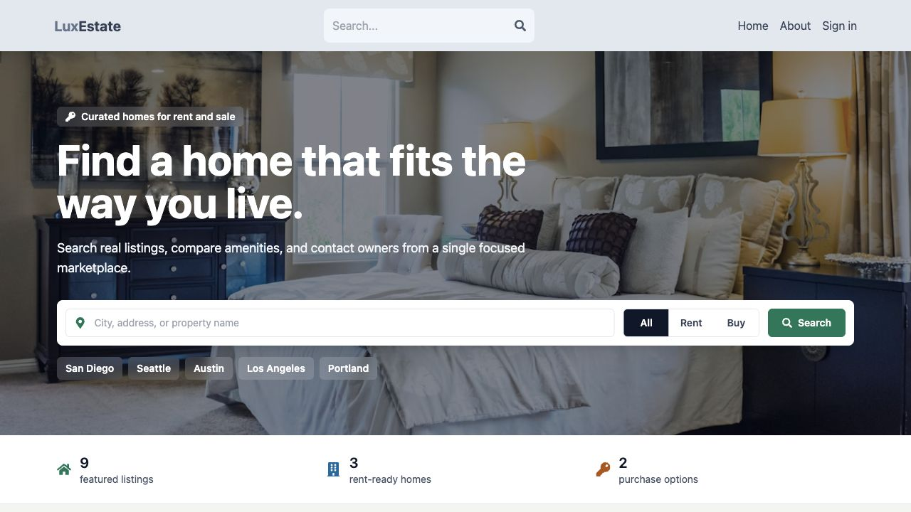
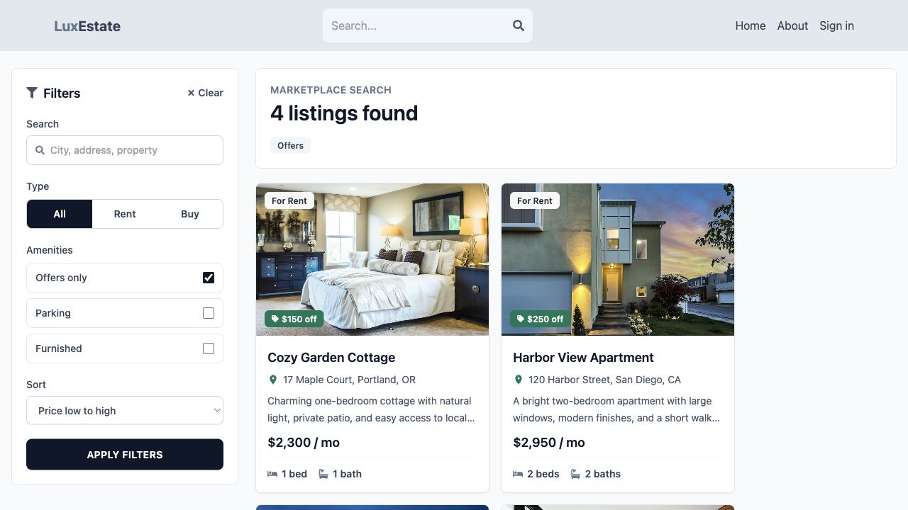
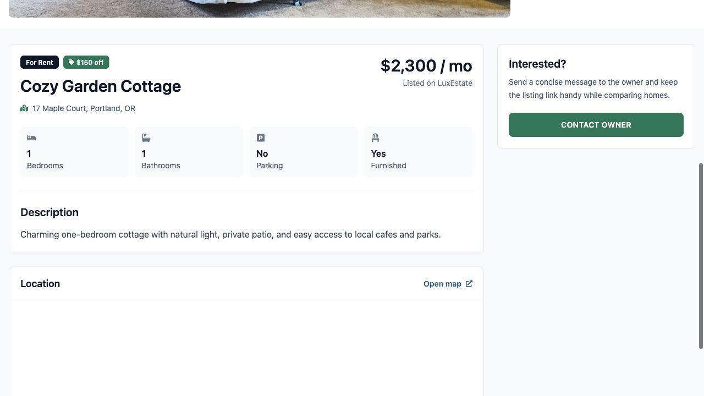
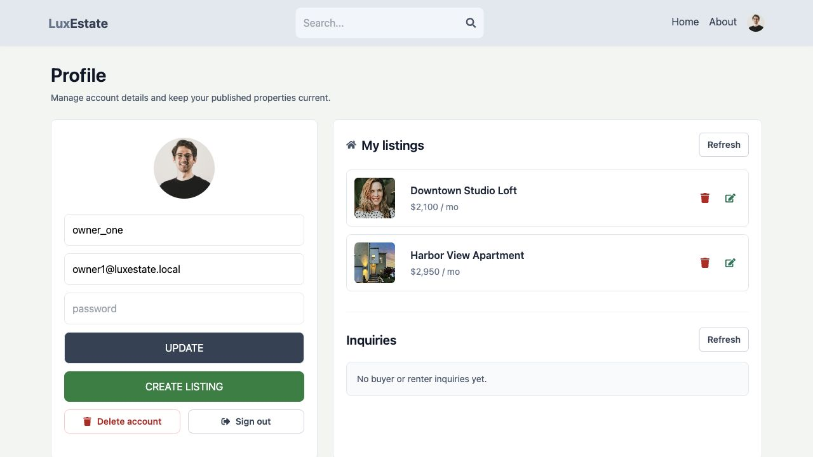
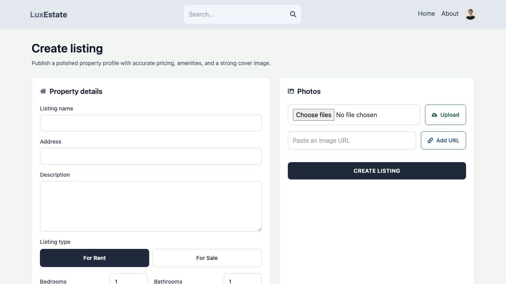
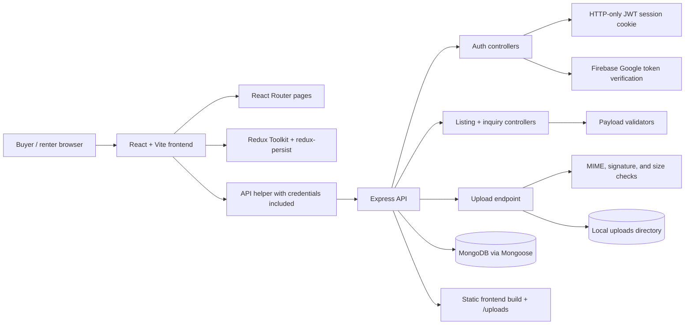

<div align="center">
  <h1>LuxEstate</h1>
  <p>
    A production-minded real estate marketplace demo for browsing homes,
    publishing listings, managing owner inquiries, and validating full-stack
    product workflows.
  </p>

  <p>
    
    
    
    
    
    
    
  </p>
</div>



## Overview

LuxEstate is a full-stack marketplace built around the real workflows a property
platform needs: searchable listing discovery, authenticated publishing, safe
image uploads, owner dashboards, and inquiry management. The codebase is kept
small enough for portfolio review, but it includes the operational touches that
make a demo feel closer to a real product.

## Product Highlights

| Area | What it covers |
| --- | --- |
| Search-first discovery | Homepage search, listing filters, sort order, offer chips, empty states, and paginated show-more behavior. |
| Listing operations | Create, update, delete, and view property listings with validated pricing, amenities, gallery images, map links, and owner-only edit controls. |
| Authenticated sessions | Email/password auth with HTTP-only JWT cookies plus Firebase Google sign-in token verification. |
| Owner workflow | Profile dashboard with owned listings, account management, and inquiry inbox states. |
| Upload safety | API image upload path checks MIME type, binary signature, size limits, and persists uploaded files under `/uploads`. |
| Quality gate | Vitest contracts, frontend lint/build, npm audit, and GitHub Actions CI workflow. |

## Frontend Preview

| Marketplace search | Listing detail |
| --- | --- |
|  |  |

| Owner dashboard | Listing creation |
| --- | --- |
|  |  |

## Architecture



## Tech Stack

| Layer | Tools |
| --- | --- |
| Frontend | React 18, Vite 8, React Router, Redux Toolkit, redux-persist, Tailwind CSS, React Icons |
| Backend | Node.js, Express, MongoDB, Mongoose, cookie-parser, jsonwebtoken, bcryptjs |
| Auth | Email/password sessions, HTTP-only JWT cookies, Firebase ID token verification for Google sign-in |
| Quality | Vitest, ESLint, npm audit, GitHub Actions |
| Local services | Docker Compose MongoDB service, local upload directory |

## Project Anatomy

```text
.
|-- api/
|   |-- controllers/      # Request orchestration and authorization
|   |-- models/           # Mongoose schemas
|   |-- routes/           # Express route modules
|   |-- scripts/          # Seed/reset helpers
|   |-- utils/            # Auth, Firebase, and error helpers
|   `-- validators/       # Listing and image validation contracts
|-- frontend/
|   |-- src/components/   # Shared UI surfaces
|   |-- src/pages/        # Route-level screens
|   |-- src/redux/        # User session state
|   `-- src/utils/        # API, upload, and formatting helpers
|-- docs/                 # Architecture notes, demo script, screenshots
|-- uploads/              # Local development uploads
`-- .github/workflows/    # CI verification
```

## Quick Start

```bash
cp .env.example .env
cp frontend/.env.example frontend/.env
docker compose up -d
npm install
npm install --prefix frontend
npm run db:reset
```

Run the API and frontend in separate terminals:

```bash
npm run dev
npm run dev:frontend
```

| Service | URL |
| --- | --- |
| Frontend | `http://localhost:5173` |
| API health check | `http://localhost:3000/api/health` |

## Environment

Root `.env`:

```bash
MONGO=mongodb://localhost:27017/luxestate
JWT_SECRET=replace_with_a_strong_secret_at_least_32_chars
FIREBASE_PROJECT_ID=lux-estate-5643b
PORT=3000
PUBLIC_BASE_URL=http://localhost:3000
UPLOAD_DIR=uploads
SEED_USER_PASSWORD=ChangeMe123!
```

Frontend `.env`:

```bash
VITE_FIREBASE_API_KEY=replace_with_firebase_web_api_key
```

`MONGO` and `JWT_SECRET` are required for the API. `FIREBASE_PROJECT_ID`
is required for Google OAuth because the API verifies Firebase ID tokens before
creating a LuxEstate session.

## Demo Accounts

After `npm run db:reset`, sign in with the configured `SEED_USER_PASSWORD`.

| Role | Email |
| --- | --- |
| Owner | `owner1@luxestate.local` |
| Owner | `owner2@luxestate.local` |
| Demo user | `demo@luxestate.local` |

## Scripts

```bash
npm run dev            # API server
npm run dev:frontend   # Vite frontend
npm run db:init        # Upsert seed users/listings
npm run db:reset       # Reset seed users/listings
npm test               # Vitest contract/unit tests
npm run verify         # Audit + tests + frontend lint/build
npm run build          # Frontend production build
```

## API Surface

<details>
<summary>Authentication</summary>

- `POST /api/auth/signup`
- `POST /api/auth/signin`
- `POST /api/auth/google`
- `POST /api/auth/signout`
- `GET /api/auth/me`

</details>

<details>
<summary>Listings</summary>

- `GET /api/listings`
- `GET /api/listings/:id`
- `POST /api/listings`
- `PATCH /api/listings/:id`
- `DELETE /api/listings/:id`
- `POST /api/listings/upload`

Legacy `/api/listing/*` routes remain mounted for backwards compatibility.

</details>

<details>
<summary>Inquiries</summary>

- `POST /api/inquiries`
- `GET /api/inquiries/mine`
- `PATCH /api/inquiries/:id/read`

</details>

## Quality Gate

Local verification and CI run the same core checks:

```bash
npm audit --audit-level=moderate
npm test
npm audit --audit-level=moderate --prefix frontend
npm run lint --prefix frontend
npm run build --prefix frontend
```

## Documentation

- [Architecture notes](docs/architecture.md)
- [Demo walkthrough script](docs/demo-script.md)

## Deployment Notes

The current upload implementation stores files in `UPLOAD_DIR` and serves them
from `/uploads`. This is suitable for local demos and single-node deployments.
For serverless production, move image storage to S3, R2, or Cloudinary and
persist only public asset URLs in MongoDB.

## License

LuxEstate is released under the ISC license.
