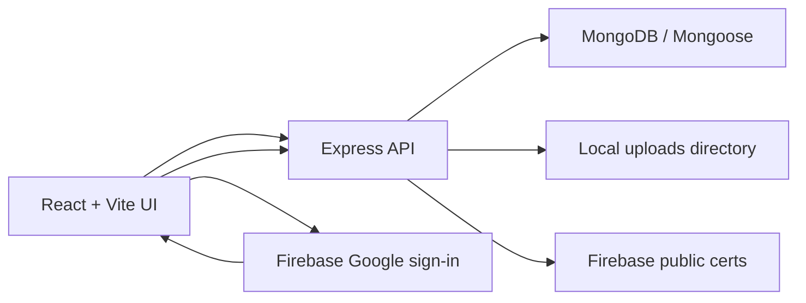

# LuxEstate Architecture

## Request Flow

1. The React app calls `/api/*` with `credentials: include`.
2. The API stores the LuxEstate session in an HTTP-only `access_token` cookie.
3. Email/password users are validated against MongoDB.
4. Google users send a Firebase ID token, which the API verifies against Firebase public signing certificates before creating a local session.
5. Listings and inquiries are stored in MongoDB. Uploaded images are validated by MIME type and file signature, then served from `/uploads`.

## Key Boundaries

- `api/controllers/*`: request orchestration and authorization.
- `api/validators/*`: testable request and file validation contracts.
- `api/models/*`: persistence schemas.
- `frontend/src/components/*`: reusable UI surfaces.
- `frontend/src/pages/*`: route-level screens and data fetching.
- `frontend/src/utils/*`: API, upload, and formatting helpers.

## Production Notes

Local file uploads are acceptable for the demo and single-node deployments. For a production serverless deployment, replace `UPLOAD_DIR` with object storage such as S3, R2, or Cloudinary and persist only the public asset URL in `Listing.imageUrls`.
